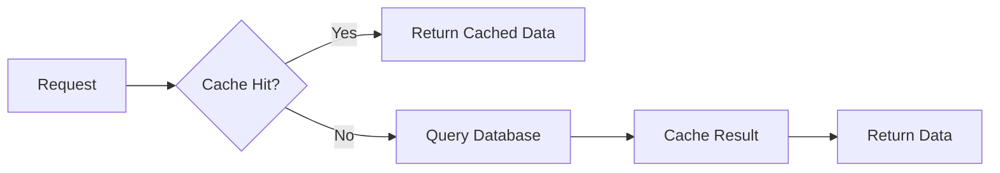

# 🛒 Hệ Thống Quản Lý Đơn Hàng (Order Management System)

Hệ thống quản lý đơn hàng được xây dựng với **ASP.NET Core 8**, **Entity Framework Core**, **Redis**, và **Docker** theo kiến trúc **Clean Architecture với Domain-Driven Design (DDD)**.

## 🏗️ Kiến Trúc & Công Nghệ

### Clean Architecture với DDD
```
src/
├── OrderManagement.Domain/        # 🧱 Domain Entities & Repository Interfaces
├── OrderManagement.Application/   # 🏢 Business Logic, DTOs, Services & Interfaces  
├── OrderManagement.Infrastructure/# 🔧 Database, Redis, Repository Implementations
└── OrderManagement.API/           # 🌐 Controllers, Swagger, Dependency Injection

tests/
└── OrderManagement.Tests/         # 🧪 Unit Tests với xUnit + Moq
```

### 💻 Stack Công Nghệ
- **.NET 8.0** - Framework chính
- **ASP.NET Core 8** - Web API với Swagger/OpenAPI
- **Entity Framework Core 8** - ORM Code-First approach
- **SQL Server** - Database chính với seed data
- **Redis** - Caching layer cho performance
- **Docker & Docker Compose** - Container orchestration
- **xUnit + Moq** - Unit testing framework
- **Clean Architecture** - Dependency Inversion Principle

## 📊 Database Schema

### Entity Relationships
```
Customer (1) ────→ (*) Order (1) ────→ (*) OrderItem (*) ←──── (1) Product
```

### Tables & Fields
**🧑‍💼 Customers**
```sql
CustomerId      INT PRIMARY KEY IDENTITY
FullName        NVARCHAR(100) NOT NULL
Address         NVARCHAR(200) NOT NULL  
PhoneNumber     NVARCHAR(15) NOT NULL
```

**📦 Products**
```sql
ProductId       INT PRIMARY KEY IDENTITY
Name            NVARCHAR(100) NOT NULL
Price           DECIMAL(18,2) NOT NULL
```

**📋 Orders**
```sql
OrderId         INT PRIMARY KEY IDENTITY
CustomerId      INT FOREIGN KEY
OrderDate       DATETIME2 NOT NULL
TotalAmount     DECIMAL(18,2) NOT NULL
```

**📦 OrderItems**
```sql
OrderItemId     INT PRIMARY KEY IDENTITY
OrderId         INT FOREIGN KEY
ProductId       INT FOREIGN KEY
Quantity        INT NOT NULL
UnitPrice       DECIMAL(18,2) NOT NULL
```

## 🚀 API Documentation

### Base URL
```
Development: https://localhost:7092/api
Swagger UI:  https://localhost:7092/swagger
```

### 👥 Customer Management API

#### **GET /api/customers**
Lấy danh sách tất cả khách hàng
```http
GET /api/customers
Accept: application/json
```
**Response 200:**
```json
[
  {
    "customerId": 1,
    "fullName": "Nguyễn Văn A",
    "address": "123 Đường ABC, TP.HCM",
    "phoneNumber": "0901234567"
  }
]
```

#### **GET /api/customers/{id}**
Lấy thông tin khách hàng theo ID
```http
GET /api/customers/1
```
**Response 200:** Customer object
**Response 404:** Customer không tồn tại

#### **POST /api/customers**
Tạo khách hàng mới
```http
POST /api/customers
Content-Type: application/json

{
  "fullName": "Trần Thị B",
  "address": "456 Đường XYZ, Hà Nội", 
  "phoneNumber": "0987654321"
}
```

#### **PUT /api/customers/{id}**
Cập nhật thông tin khách hàng
```http
PUT /api/customers/1
Content-Type: application/json

{
  "fullName": "Nguyễn Văn A Updated",
  "address": "789 Đường DEF, TP.HCM",
  "phoneNumber": "0901111111"
}
```

#### **DELETE /api/customers/{id}**
Xóa khách hàng
```http
DELETE /api/customers/1
```
**Response 204:** Xóa thành công
**Response 404:** Customer không tồn tại

### 📦 Product Management API

#### **GET /api/products**
Lấy danh sách tất cả sản phẩm
```http
GET /api/products
```
**Response:**
```json
[
  {
    "productId": 1,
    "name": "Laptop Dell",
    "price": 15000000
  },
  {
    "productId": 2,
    "name": "Mouse Logitech", 
    "price": 500000
  }
]
```

#### **GET /api/products/{id}**
Lấy thông tin sản phẩm theo ID
```http
GET /api/products/1
```

### 📋 Order Management API

#### **GET /api/orders**
Lấy danh sách đơn hàng (với filtering)
```http
# Tất cả đơn hàng
GET /api/orders

# Lọc theo khách hàng
GET /api/orders?customerId=1

# Lọc theo ngày
GET /api/orders?fromDate=2024-01-01&toDate=2024-12-31

# Lọc kết hợp
GET /api/orders?customerId=1&fromDate=2024-01-01&toDate=2024-12-31
```

#### **GET /api/orders/{id}**
Lấy chi tiết đơn hàng
```http
GET /api/orders/1
```
**Response:**
```json
{
  "orderId": 1,
  "customerId": 1,
  "customerName": "Nguyễn Văn A",
  "orderDate": "2024-12-02T10:30:00",
  "totalAmount": 31000000,
  "orderItems": [
    {
      "orderItemId": 1,
      "productId": 1,
      "productName": "Laptop Dell",
      "quantity": 2,
      "unitPrice": 15000000
    },
    {
      "orderItemId": 2,
      "productId": 2,
      "productName": "Mouse Logitech",
      "quantity": 2,
      "unitPrice": 500000
    }
  ]
}
```

#### **POST /api/orders**
Tạo đơn hàng mới
```http
POST /api/orders
Content-Type: application/json

{
  "customerId": 1,
  "orderItems": [
    {
      "productId": 1,
      "quantity": 2
    },
    {
      "productId": 3,
      "quantity": 1
    }
  ]
}
```
**Business Logic:**
- ✅ Auto-calculate TotalAmount = sum(quantity × unitPrice)
- ✅ Validate Customer exists
- ✅ Validate tất cả Products exist
- ✅ Auto-set OrderDate = DateTime.Now

## ⚙️ Hướng Dẫn Cài Đặt & Chạy

### 📋 Prerequisites
```bash
1. .NET 8 SDK - https://dotnet.microsoft.com/download
2. Docker Desktop - https://www.docker.com/products/docker-desktop
3. Git
4. IDE: Visual Studio 2022 / VS Code / Rider
```

### 🔧 Bước 1: Clone & Setup
```bash
# Clone repository
git clone <repository-url>
cd OrderManagement

# Check .NET version
dotnet --version
# Phải >= 8.0.0
```

### 🐳 Bước 2: Start Infrastructure với Docker
```bash
# Start SQL Server + Redis
docker-compose up -d

# Verify services running
docker ps

# Expected output:
# - sqlserver (port 1433)
# - redis (port 6379)
```

**🔍 Kiểm tra services:**
```bash
# Test SQL Server connection
docker exec -it <sqlserver-container> sqlcmd -S localhost -U sa -P "YourStrong@Passw0rd"

# Test Redis connection  
docker exec -it <redis-container> redis-cli ping
# Expected: PONG
```

### 🏃‍♂️ Bước 3: Run Application

#### Option 1: Command Line
```bash
# Restore NuGet packages
dotnet restore

# Build solution
dotnet build

# Run API project
cd src/OrderManagement.API
dotnet run

# Hoặc với watch mode (auto-reload)
dotnet watch run
```

#### Option 2: Visual Studio
```bash
1. Open OrderManagement.sln
2. Set OrderManagement.API as Startup Project
3. Press F5 hoặc Ctrl+F5
```

### 🌐 Bước 4: Access Application
```bash
✅ API:         https://localhost:7092/api
✅ Swagger UI:  https://localhost:7092/swagger  
✅ Health:      https://localhost:7092/api/customers
```

**🎯 Test API nhanh:**
```bash
# Using curl
curl https://localhost:7092/api/customers

# Using PowerShell
Invoke-RestMethod -Uri "https://localhost:7092/api/customers"
```

## 🧪 Testing

### Unit Tests
```bash
# Run all tests
dotnet test

# Run với coverage
dotnet test --collect:"XPlat Code Coverage"

# Run specific test class
dotnet test --filter "CustomerServiceTests"

# Verbose output
dotnet test --logger "console;verbosity=detailed"
```

### Test Coverage
- ✅ **CustomerService**: CRUD + Caching scenarios
- ✅ **OrderService**: Order creation + Business validation
- ✅ **Repository Mocking**: Data access layer
- ✅ **Error Handling**: Exception scenarios

### Manual Testing với Swagger
1. Mở https://localhost:7092/swagger
2. Test **GET /api/products** (xem seed data)
3. Test **POST /api/customers** (tạo customer mới)
4. Test **POST /api/orders** (tạo order với customer + products)

## 🚀 Performance Features

### 🔥 Redis Caching Strategy
```yaml
Cache TTL Settings:
  - Customers:     10 minutes  # Ít thay đổi
  - Products:      15 minutes  # Ít thay đổi nhất  
  - Orders:        5 minutes   # Thay đổi nhiều
  - Cache Keys:    "customer:1", "products:all", "order:123"
```

**Cache Flow:**


### ⚡ Performance Optimizations
- **Async/Await** pattern toàn bộ application
- **Connection pooling** cho SQL Server
- **Lazy loading** với Include() statements
- **Bulk operations** cho OrderItems
- **Memory optimization** với IEnumerable

## 🔧 Configuration

### appsettings.json
```json
{
  "ConnectionStrings": {
    "DefaultConnection": "Server=localhost,1433;Database=OrderManagementDB;User Id=sa;Password=YourStrong@Passw0rd;TrustServerCertificate=true;",
    "Redis": "localhost:6379"
  },
  "Logging": {
    "LogLevel": {
      "Default": "Information",
      "Microsoft.AspNetCore": "Warning"
    }
  }
}
```

### docker-compose.yml Services
```yaml
services:
  sqlserver:
    image: mcr.microsoft.com/mssql/server:2022-latest
    ports: ["1433:1433"]
    environment:
      SA_PASSWORD: "YourStrong@Passw0rd"
      ACCEPT_EULA: "Y"

  redis:
    image: redis:7-alpine  
    ports: ["6379:6379"]
```

## 📋 Seed Data

Khi chạy application lần đầu, database sẽ được tự động tạo với data mẫu:

### 👥 Sample Customers
```
ID  | Tên           | Địa chỉ                    | SĐT
1   | Nguyễn Văn A  | 123 Đường ABC, TP.HCM     | 0901234567
2   | Trần Thị B    | 456 Đường XYZ, Hà Nội     | 0987654321
```

### 📦 Sample Products  
```
ID  | Tên sản phẩm         | Giá (VND)
1   | Laptop Dell          | 15,000,000
2   | Mouse Logitech       | 500,000  
3   | Keyboard Mechanical  | 1,200,000
4   | Monitor Samsung      | 8,000,000
```

## 🛠️ Troubleshooting

### ❌ Common Issues

**1. Database Connection Failed**
```bash
# Check SQL Server container
docker logs <sqlserver-container-id>

# Test connection
docker exec -it <sqlserver-container> sqlcmd -S localhost -U sa
```

**2. Redis Connection Failed**
```bash
# Check Redis container  
docker logs <redis-container-id>

# Test Redis
docker exec -it <redis-container> redis-cli ping
```

**3. Port Already in Use**
```bash
# Find process using port 7092
netstat -ano | findstr :7092

# Kill process
taskkill /PID <process-id> /F
```

**4. Docker Issues**
```bash
# Reset Docker containers
docker-compose down
docker-compose up -d --force-recreate

# Clear Docker cache
docker system prune -a
```

### 📊 Health Checks
```bash
# API Health
curl https://localhost:7092/api/customers

# Database Health  
curl https://localhost:7092/api/products

# Redis Health (trong logs)
# "Successfully connected to Redis"
```

## 🏆 Architecture Benefits

### ✅ Clean Architecture Advantages
- **Testability**: Dễ test với dependency injection
- **Maintainability**: Tách biệt concerns rõ ràng
- **Scalability**: Dễ extend functionality
- **Flexibility**: Swap implementations (Redis → MemoryCache)

### 🔄 Dependency Flow
```
API → Application → Domain ← Infrastructure
```
- **API** chỉ phụ thuộc Application
- **Application** chỉ phụ thuộc Domain  
- **Infrastructure** implement interfaces từ Application
- **Domain** không phụ thuộc gì (pure business logic)

## 📝 Development Notes

### Useful Commands
```bash
# Build specific project
dotnet build src/OrderManagement.API

# Watch specific project  
dotnet watch --project src/OrderManagement.API

# Add NuGet package
dotnet add src/OrderManagement.Infrastructure package StackExchange.Redis

# Entity Framework
dotnet ef database update --project src/OrderManagement.Infrastructure

# Generate migration
dotnet ef migrations add InitialCreate --project src/OrderManagement.Infrastructure
```

### Code Quality
- ✅ **Consistent naming** theo C# conventions
- ✅ **Async/await** cho tất cả I/O operations  
- ✅ **Error handling** với proper HTTP status codes
- ✅ **Validation** ở multiple layers
- ✅ **Logging** configured sẵn
- ✅ **CORS** enabled cho frontend development

---

## 📞 Support

Nếu gặp vấn đề, hãy check:
1. ✅ .NET 8 SDK installed
2. ✅ Docker Desktop running
3. ✅ Ports 1433, 6379, 7092 không bị conflict
4. ✅ Swagger UI hoạt động: https://localhost:7092/swagger

**Happy Coding! 🚀** 